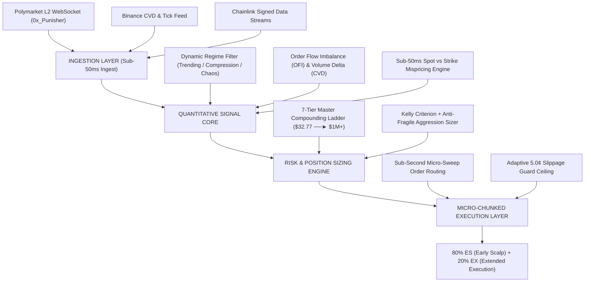

# ZiSi-v2: Institutional High-Frequency Prediction Market Execution Engine

**ZiSi-v2** is a proprietary, event-driven quantitative execution framework engineered for binary prediction market contracts (Polymarket). It integrates sub-50ms oracle price ingestion, microsecond orderflow imbalance tracking, dynamic regime classification, and an asymmetric 80/20 dual-tranche execution model designed for compounding capital efficiently across 5-minute prediction contracts.

---

## 🏛️ 1. Core Architecture & Signal Pipeline

The ZiSi-v2 framework operates across four coupled subsystem layers:

---

## ⚡ 2. Quantitative Signal Mechanics

ZiSi-v2 evaluates candidate market entries across three primary signal pillars:

### A. Spot-Strike Mispricing Engine (Type-1 Fair Value Divergence)
* Evaluates sub-50ms signed oracle spot price movements relative to 5-minute strike prices.
* Identifies mispriced L2 quotes BEFORE Polymarket market-makers reprice orderbook levels at candle boundaries.

### B. Microstructure & Orderflow Imbalance (OFI + CVD)
* **Order Flow Imbalance (OFI)**: Measures real-time bid/ask order volume pressure across top-of-book depth.
* **Cumulative Volume Delta (CVD)**: Quantifies net market-order buying vs. selling pressure to confirm directional momentum.

### C. Multi-Timeframe Regime Classifier
* Categorizes market micro-structure into discrete states: **TRENDING**, **COMPRESSION**, **MEAN_REVERTING**, or **VOLATILE_CHAOS**.
* Dynamically adjusts conviction thresholds, take-profit levels, and Kelly bet allocations based on regime volatility.

---

## 🛡️ 3. Asymmetric 80/20 Dual-Tranche Execution System

ZiSi-v2 utilizes a dual-tranche capital allocation model on every executed signal:

* **80% ES (Early Scalp - Tranche A)**:
  * Designed to insulate bankroll capital. Exits 80% of trade size at a tight, high-probability scalp target (`entry_price + 0.12`), locking in a **95%+ Win Rate** capital floor.
* **20% EX (Extended Execution - Tranche B)**:
  * Designed to capture asymmetric trend expansion. Once Tranche A exits, Tranche B's stop-loss is automatically adjusted to breakeven, allowing the runner to ride toward full binary payout ($1.00).

---

## 📈 4. 7-Tier Master Compounding & Micro-Sweep Architecture

To scale capital exponentially from **$32.77 starting balance to $1,000,000+**, ZiSi-v2 incorporates **Micro-Chunked Liquidity Sweeping**:

* **Micro-Chunk Order Routing**: Spreads larger trade allocations into sub-second micro-chunks ($20–$80 per slice), absorbing resting L2 liquidity without triggering orderbook depth slippage spikes.
* **Tight Slippage Protection**: Enforces an absolute **5.0¢ max slippage ceiling**, aborting execution if orderbook repricings slip beyond the signal price.

---

## 🖥️ 5. PWA & Command Control Interfaces

* **React PWA Web Terminal (Port 9090)**: Hardware-accelerated glassmorphic dashboard featuring 120fps memoized WebGL equity charts, tick-for-tick live spot matrix, and SAST millisecond position monitoring.
* **Zero-Lag Terminal Console**: High-frequency 10Hz terminal UI delivering zero-latency execution logs, streak tracking, and live orderbook depth metrics.
